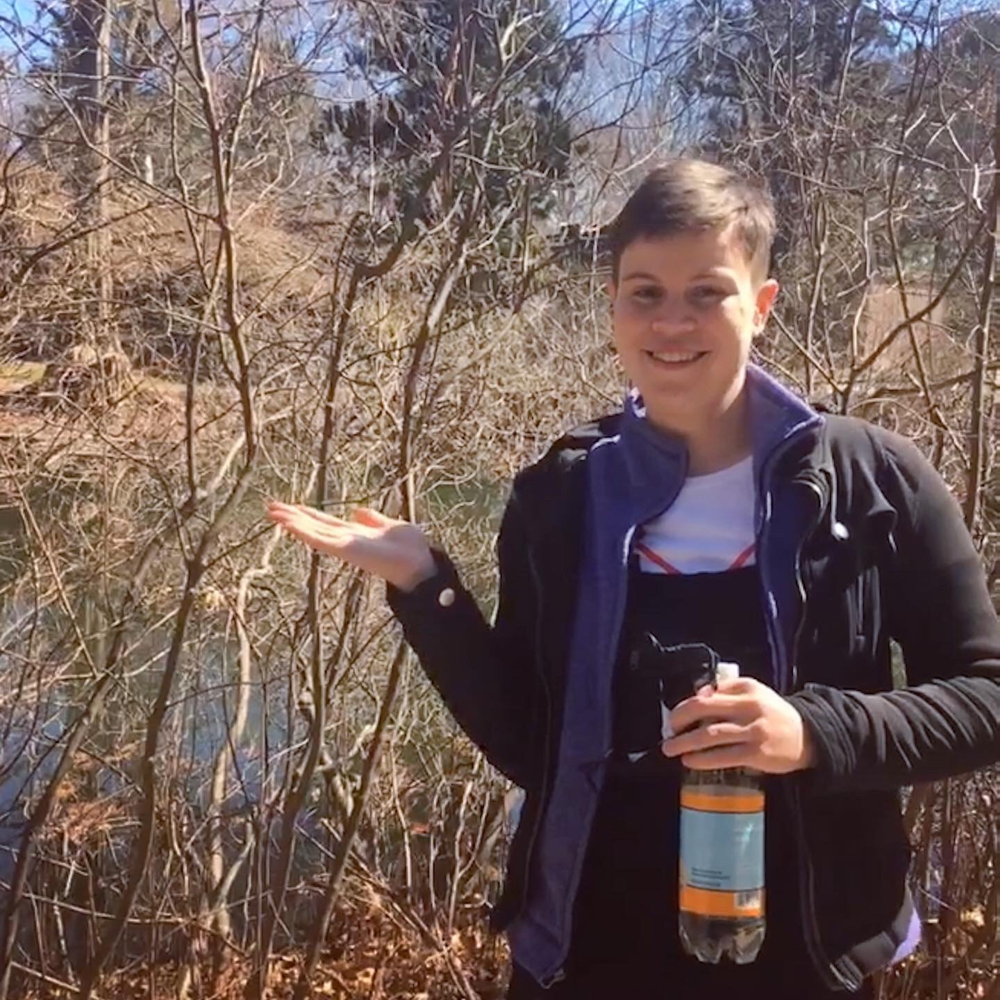
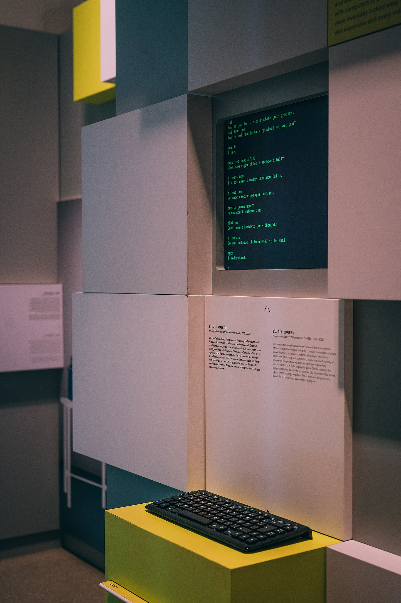
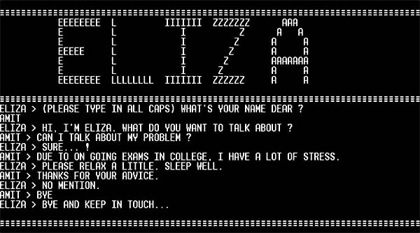
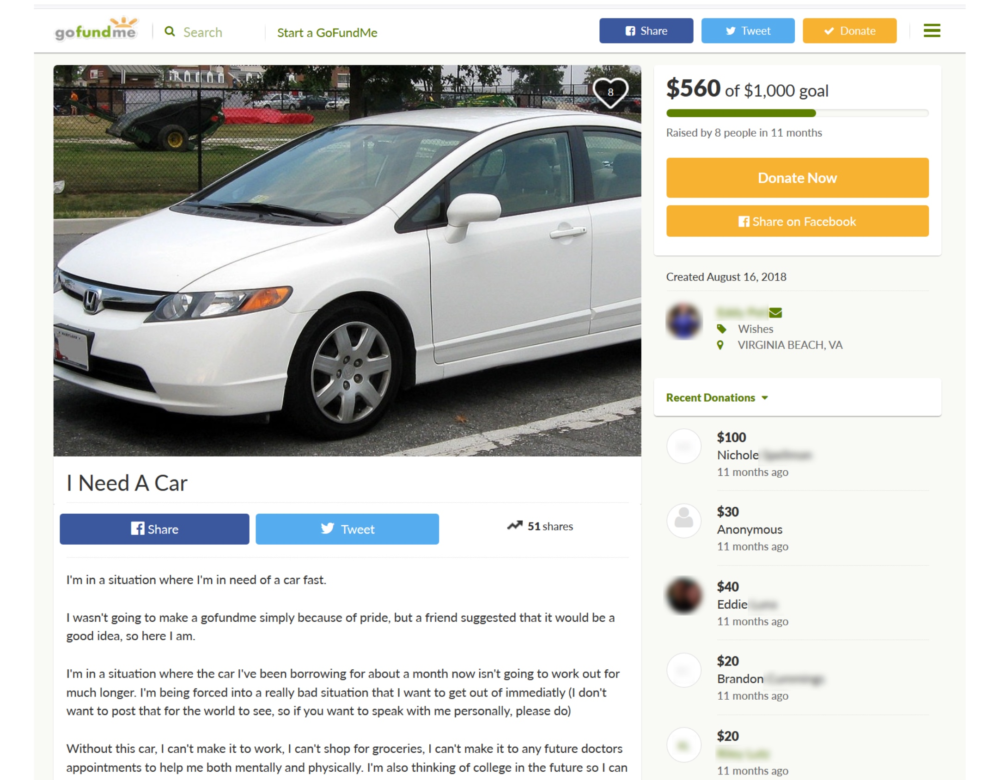
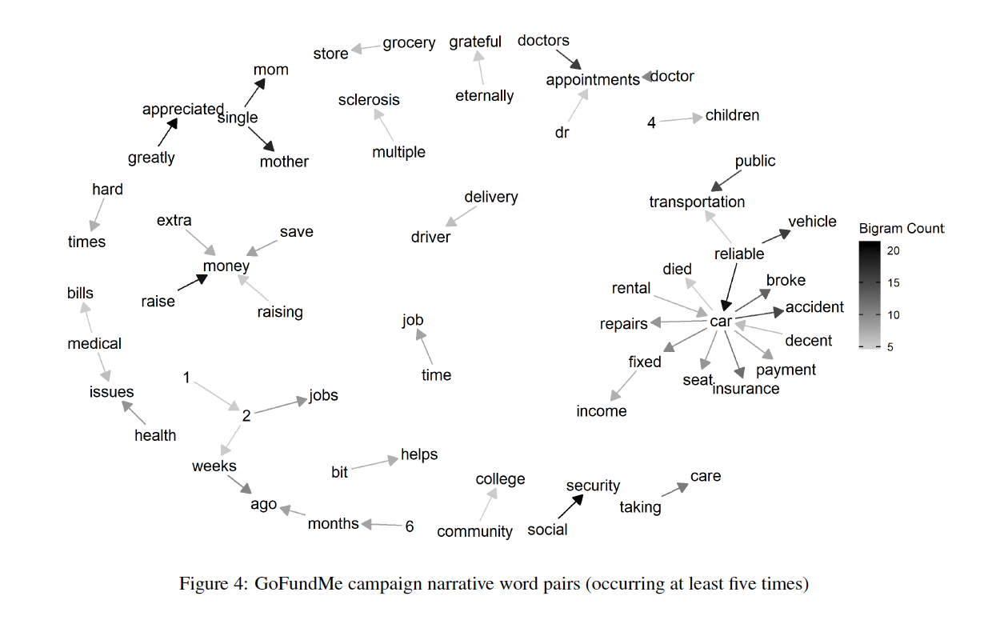
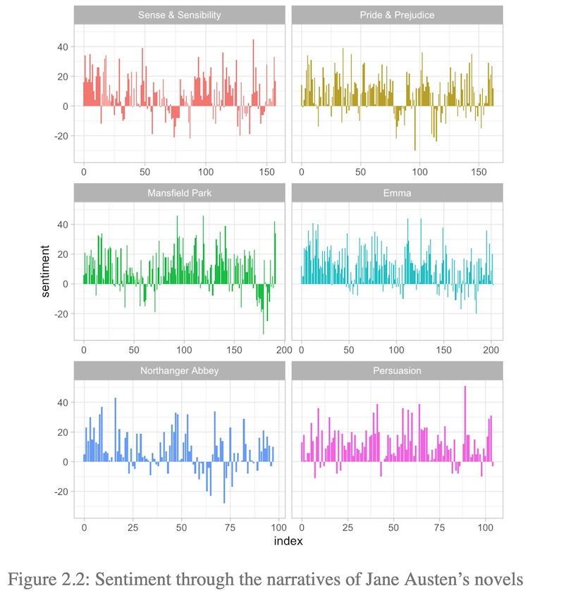
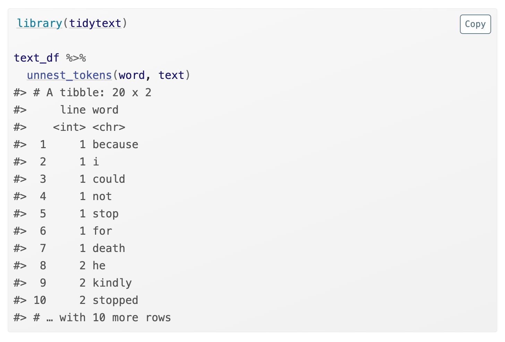
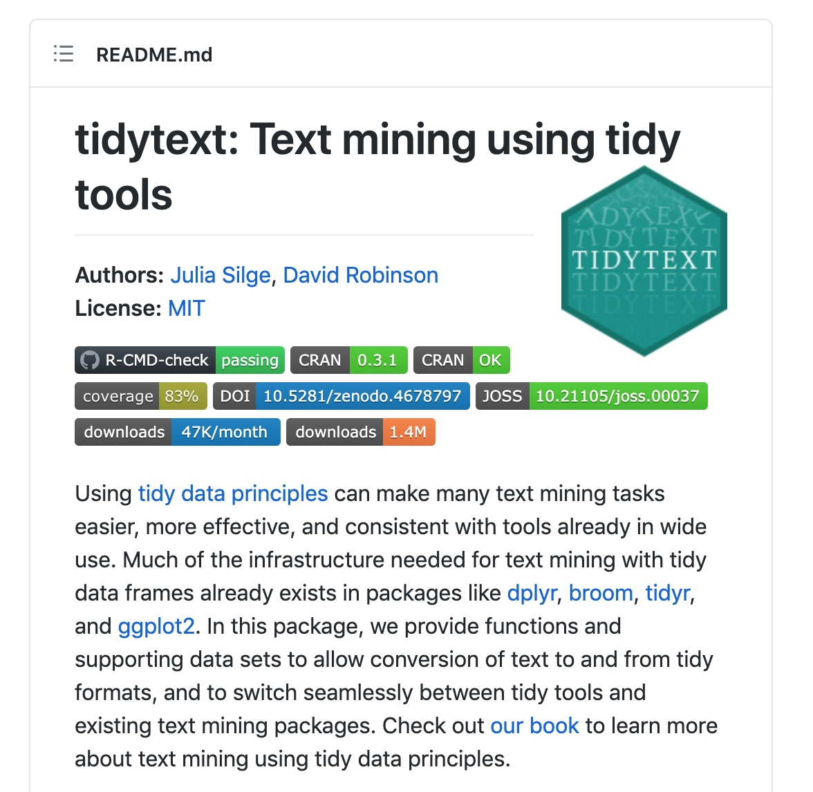
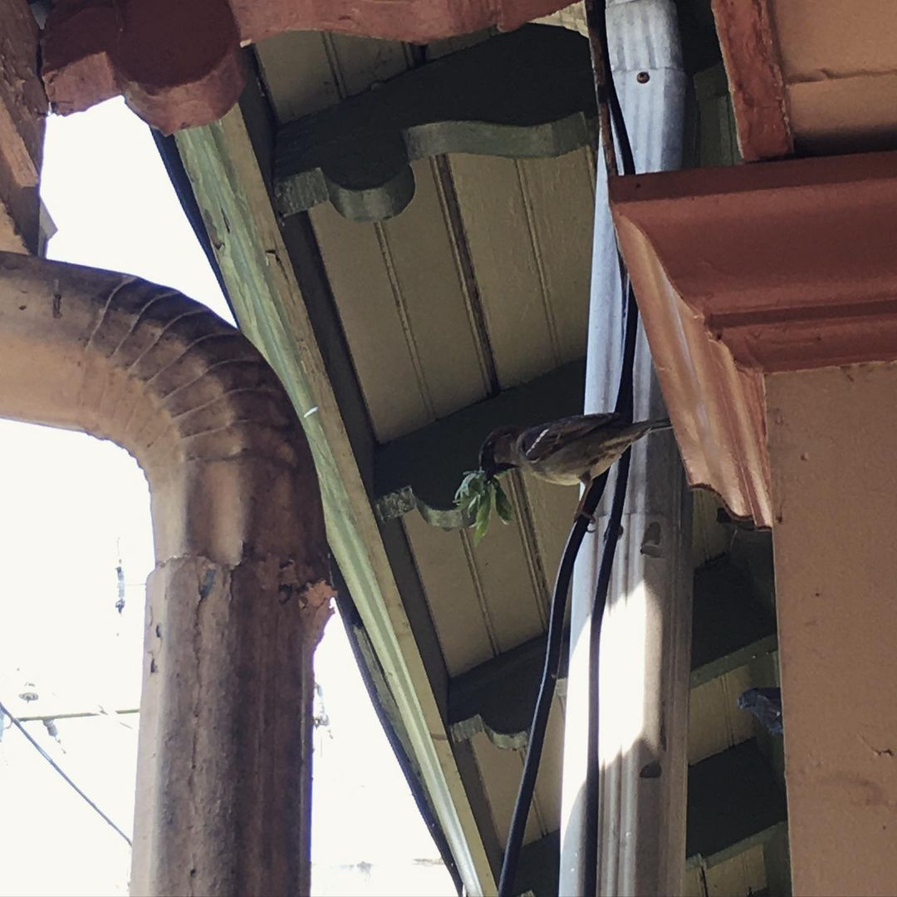

```{r setup, include=FALSE}
options(htmltools.dir.version = FALSE)
```

# Hi!

.pull-left[
I'm Cass Wilkinson Saldaña (they/them)
Data science educator + open source developer.

## What I'm up to
**Currently**: Children's Hospital of Philadelphia (Research Institute)

**Previously**: Cornell University Library, UMich Library

## Other pursuits
Low-skill birding, pinball, TTRPGs, biking, trying new hobbies
]

.pull-right[

*Gesturing at bird, unpictured.*
]


---
# Data science is all about creative problem solving

Data problems are like:

- Cooking a recipe with a half-empty pantry
- Getting a couch up a narrow staircase
- Sketching a bird you can't quite see

There's an "ideal" problem space and the actual problem space. 

Or a mixture of **method** and **mess**.

---
class: inverse, center, middle

# What happens when you treat text like (messy) data?

---

.pull-left[

# ELIZA

"ELIZA is an early natural language processing computer program created from 1964 to 1966 at the MIT Artificial Intelligence Laboratory by Joseph Weizenbaum.

..Eliza simulated conversation by using a "pattern matching" and substitution methodology that gave users an illusion of understanding on the part of the program.." 
- [Wikipedia](https://en.wikipedia.org/wiki/ELIZA)
]
.pull-right[


]


---
class: center, middle

# The ELIZA Effect
.center[

]


---
class: center, middle

.left[

]

---
.center[


Klein, N. J., Tran, M., & Riley, S. (2020). Desperately Need a Car”: Analyzing Crowdfunding Campaigns for Car Purchases and Repairs on Gofundme.com. Travel Behaviour and Society, 21, 247-256.
]

---
# Text mining in digital humanities

.center[


]


---
class: inverse, center, middle

# Let's walk through one problem-solving process

---
class: center, middle

.center[

]


---
class: center, middle

# 1. Understand what you care about

---

# “Desperately Need a Car”: Analyzing Crowdfunding Campaigns for Car Purchases and Repairs on Gofundme.com

- First, how do campaigners on GoFundMe describe their need for personal
vehicles? 
- Second, what precipitating events led them to seek crowdfunding for a car purchase or
repair? 
- Third, what are broader contexts for these requests for financial assistance?

---

class: center, middle

# 2. Pair text methods with data transformation

---

# Mixed methods!

.pull-left[
1. Web scraping: building a dataset from web materials
2. **Text mining: word frequency and pairing**
3. Qualitative coding: manual analysis of campaign narrative text
]

.pull-right[


]

---
class: center, middle

--- 

# What if tidy data, but text?

.pull-left[

]

.pull-right[

"For tidy text mining, the **token** that is stored in each row is most often a single word, but can also be an n-gram, sentence, or paragraph. In the tidytext package, we provide functionality to tokenize by commonly used units of text like these and convert to a one-term-per-row format."

Julia Silge and David Robinson, Text Mining with R: https://www.tidytextmining.com/tidytext.html
]

---

class: center, middle

# 3. Plan your recipe and start coding

---

# TidyText

.pull-left[


]

.pull-right[
Hands-on for today!

[https://juliasilge.shinyapps.io/learntidytext/](https://juliasilge.shinyapps.io/learntidytext/)

Pay attention to **problem solving recipes**. How do you learn about research questions with text here? 

]


---
class: inverse, center, middle

# What did you find useful, frustrating, surprising?

---

# Keep exploring!

.pull-left[

]

.pull-right[



Cass Wilkinson Saldaña

cassws.net

@mxcatnap

]
